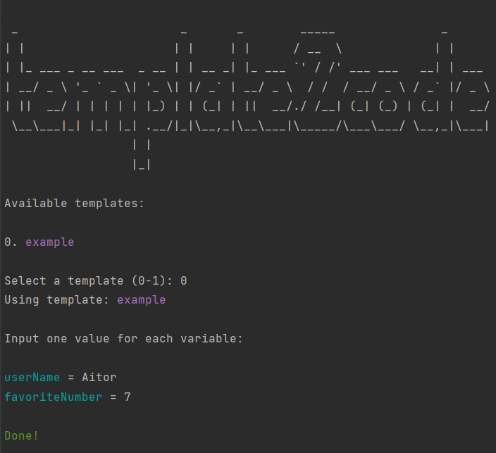

[](https://github.com/tterb/atomic-design-ui/blob/master/LICENSEs) [](https://forthebadge.com)


# template2code

Template-based and language-agnostic code generation script.

Mainly designed to save development time while writing boilerplate code.
Allows to quickly scaffold a custom file structure defined by a template.

Templates are directories which can contain placeholders in file contents, file names and folder names. Once a template is selected, the CLI script will prompt you to enter a value for each different placeholder found in the template, then will generate an output mirroring the template and replacing placeholders with specified values.
## Usage

### 1. Build a template

Simply create a new directory under the templates' directory (./templates by default). Its name will be the name of the template.

Inside the template directory create as many folders and files as you need, adding placeholders in file/directory names or file contents with the following syntax `{{placeholderName}}` (customization is possible, see [Configuration](#configuration)).

### 2. Generate code from template

Run the script and follow the instructions.

```
node t2c.js
```

## Example run

Example showing how the example output located in ./generated was obtained.



## Configuration

The script will use all settings specified in `t2c.config.js`.

These properties can be modified to customize settings like templates directory, output directory or placeholder syntax.
